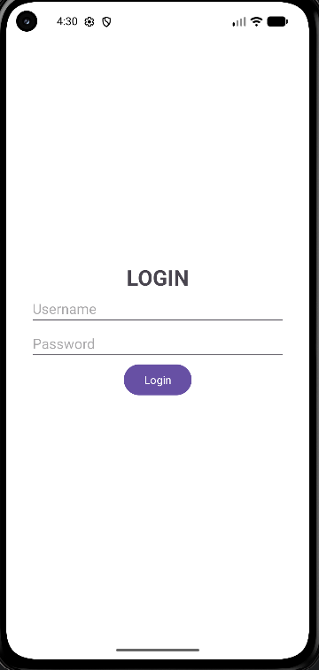

# Experiment 4 – Linking Two Activities Using Intents

## Aim

To develop an Android application that demonstrates linking two activities using Android Intents and passing user information from one activity to another.

## Objectives

- To understand the concept of Android Activities.
- To understand the concept and use of Android Intents.
- To create and link two activities in an Android application.
- To design a Login Activity using XML.
- To accept user details such as Name, USN, and Password.
- To use an explicit Intent to navigate from one activity to another.
- To pass user information from the Login Activity to the Dashboard Activity.
- To retrieve the transferred information using Intent extras.
- To display the received user details on the Dashboard screen.
- To test the application using different test cases and verify the expected output.

## Concept / Technology Behind the Experiment

### Android Activity

An **Activity** represents a single screen in an Android application. Each activity provides a user interface and handles user interactions.

In this experiment, two activities are used:

- **MainActivity** – Provides the Login screen.
- **DashboardActivity** – Displays the user information received from MainActivity.

### Android Intent

An **Intent** is a messaging object used to communicate between Android components.

In this experiment, an **explicit Intent** is used to navigate from `MainActivity` to `DashboardActivity`.

The Intent is also used to transfer the user's Name, USN, and Password.

```kotlin
val intent = Intent(this, DashboardActivity::class.java)

intent.putExtra("name", name)
intent.putExtra("usn", usn)
intent.putExtra("password", password)

startActivity(intent)

## Scenario Used

The scenario used in this experiment is a **Login and Dashboard application**.

The application consists of two activities:

- **MainActivity** – Provides the Login screen.
- **DashboardActivity** – Displays the user details received from the Login screen.

### Login Activity

The Login Activity contains input fields for:

- Name
- USN
- Password

The user enters the required details and clicks the **LOGIN** button.

### Activity Navigation

When the LOGIN button is clicked, an explicit Intent is created to navigate from `MainActivity` to `DashboardActivity`.

The user details are passed through the Intent using `putExtra()`.

### Dashboard Activity

The Dashboard Activity receives the data from the Intent using `getStringExtra()` and displays the entered user information.

### Application Flow

```text
Start Application
       |
       v
Login Activity
       |
       v
Enter Name, USN and Password
       |
       v
Click LOGIN Button
       |
       v
Create Explicit Intent
       |
       v
Pass User Details
       |
       v
Dashboard Activity
       |
       v
Retrieve Intent Data
       |
       v
Display User Details

## Project Folder and File Structure

The project follows the standard Android Studio project structure.

```text
Experiment4/
│
├── app/
│   ├── src/
│   │   └── main/
│   │       ├── java/
│   │       │   └── com.example.exp4/
│   │       │       ├── MainActivity.kt
│   │       │       └── DashboardActivity.kt
│   │       │
│   │       ├── res/
│   │       │   ├── layout/
│   │       │   │   ├── activity_main.xml
│   │       │   │   └── activity_dashboard.xml
│   │       │   │
│   │       │   ├── drawable/
│   │       │   │
│   │       │   └── values/
│   │       │       ├── colors.xml
│   │       │       ├── strings.xml
│   │       │       └── themes.xml
│   │       │
│   │       └── AndroidManifest.xml
│   │
│   └── build.gradle.kts
│
├── gradle/
│
├── Screenshot/
│   ├── output1.png
│   ├── output2.png
│   └── output3.png
│
├── build.gradle.kts
├── gradle.properties
├── gradlew
├── gradlew.bat
├── README.md
└── settings.gradle.kts

## Application Output

The Android application was successfully executed in Android Studio. The application starts with the Login Activity, where the user enters the required details. After clicking the **LOGIN** button, the application navigates to the Dashboard Activity using an explicit Intent.

The Dashboard Activity receives the information passed from the Login Activity and displays the user details.

### Output Screenshot


## Test Cases

The application was tested using three test cases to verify user input, activity navigation, Intent data transfer, and correct output.

### Test Case 1 – Valid User Details with Name and USN

**Test Case ID:** TC01

**Scenario:**  
Verify that the application accepts valid user details and successfully navigates from the Login Activity to the Dashboard Activity.

**Test Input:**

```text
Name     : Harshini
USN      : YOUR_USN
Password : 123456

## Student Name and USN Test Case

Test Case 1 includes the student's Name and USN to satisfy the requirement that at least one test case must demonstrate the student's actual identity details.

**Student Name:** Harshini  
**USN:** YOUR_USN

The Name and USN are entered in the Login Activity and passed to the Dashboard Activity using an Intent.

### Test Steps

1. Open the application.
2. Enter the student's actual Name.
3. Enter the student's actual USN.
4. Enter the Password.
5. Click the **LOGIN** button.
6. Verify that the Dashboard Activity opens.
7. Verify that the student's Name and USN are displayed correctly.

### Expected Result

The Dashboard Activity should display the student's actual Name and USN after successful navigation from the Login Activity.

### Status

**PASS**

### Screenshot Showing Name and USN


> **Note:** Replace `YOUR_USN` with your actual USN. Make sure the same Name and USN are clearly visible in `output1.png` before submitting the experiment.

## Result

The Android application was successfully developed and executed using Android Studio.

The application successfully demonstrates:

- Creation of two Android activities.
- Design of the Login Activity using XML.
- Acceptance of Name, USN, and Password as user input.
- Handling of the LOGIN button click.
- Creation and use of an explicit Intent.
- Navigation from MainActivity to DashboardActivity.
- Passing user information from one activity to another.
- Retrieving data using Intent extras.
- Displaying the transferred user information on the Dashboard.
- Successful execution of all three test cases.
- Verification of the student's Name and USN in the application output.

All the test cases passed successfully and produced the expected output.

## Conclusion

This experiment successfully demonstrates the concept of **linking two Android activities using Intents**.

The Login Activity collects the user's Name, USN, and Password. When the LOGIN button is clicked, an explicit Intent is created to open the Dashboard Activity. The entered information is transferred through the Intent and retrieved by the Dashboard Activity.

The application was tested using three test cases covering valid user details, different user details, and activity navigation with data transfer. The output screenshots are included in the `Screenshot` folder.

Thus, the objective of implementing **Activity Linking and Data Transfer using Android Intents** was successfully achieved.
